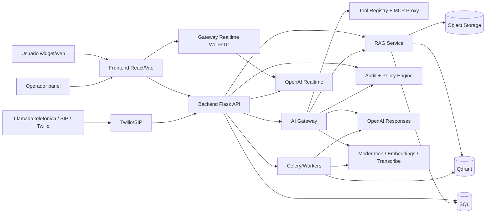

# chatboc.ar — CODEX maestro de transformación

## 1. Tesis

No conviene reescribir chatboc.ar desde cero. La plataforma ya tiene una base útil: backend Flask multi-tenant, tickets con chat y colaboración, catálogo con embeddings + Qdrant, widget embebible y puente de voz con Realtime/Twilio. El problema no es de producto base; el problema es de **fragmentación de la capa IA, deuda de identidad/seguridad y falta de gobierno operativo**.

La estrategia correcta es:

1. **Endurecer identidad, aislamiento y auditoría antes de agregar más “magia”.**
2. **Unificar la capa IA sobre Responses API** y dejar Chat Completions sólo como compatibilidad temporal.
3. **Mantener RAG propio** como motor principal para gobiernos/empresas; no delegar el core del conocimiento a herramientas hosted salvo casos acotados.
4. **Agregar voz browser-first con WebRTC** y sostener WebSocket para server-to-server / telefonía.
5. **Industrializar evaluaciones, prompts y costos** para que cada tenant tenga calidad controlada.
6. **Implementar un modelo de tools/MCP con allowlists y trazabilidad**, no “herramientas abiertas”.

## 2. Lo que ya existe y no hay que romper

Mantener compatibilidad con:

- contratos `/ask/*`, `/tickets/*`, `/catalogo/*`;
- contexto de tenant vía headers/tokens;
- widget embebible;
- tickets y timeline existentes;
- Qdrant como infraestructura ya integrada;
- Twilio + voice bridge actual;
- panel municipal / pyme.

## 3. Decisiones técnicas duras

### 3.1 No reemplazar el frontend propio por ChatKit como core
ChatKit es útil para prototipos rápidos y embebidos, pero chatboc.ar ya es un producto multi-tenant con identidad dual, panel propio, tickets, catálogos y contratos específicos. Reemplazar el frontend sería perder control y diferencial.  
**Uso recomendado de ChatKit:** sandbox comercial, demos rápidas o PoCs aisladas.  
**No recomendado:** reemplazo del widget/panel principal.

### 3.2 No usar OpenAI-hosted file search como base principal del RAG ciudadano/enterprise
Para gobierno/empresa, el core debe seguir en Qdrant + storage propio + filtros estrictos por tenant/fuente/permiso.  
**Uso recomendado de file search:** asistentes internos de baja criticidad o PoCs donde la velocidad de implementación importe más que el control fino.  
**No recomendado:** conocimiento principal de expedientes, normativa sensible o catálogos multi-tenant.

### 3.3 No usar stored conversations de OpenAI como memoria principal
La memoria principal debe quedar en tu backend/DB para controlar retención, borrado, auditoría y residencia.  
El gateway IA debe usar `store=false` por defecto y manejar el estado del lado de chatboc.  
Solo habilitar almacenamiento de OpenAI en entornos internos y no sensibles.

### 3.4 No habilitar MCPs remotos arbitrarios
MCP es valioso, pero en producción debe existir una capa de aprobación:
- allowlist por tenant;
- clasificación de riesgo por tool;
- scopes por rol;
- auditoría completa;
- aprobación humana para acciones destructivas o sensibles.

### 3.5 No meter computer use en producción pública todavía
Computer use es interesante para copilotos operativos, pero no es lo correcto para flujos públicos o de alto riesgo.  
Sirve para backoffice/sandbox sobre entornos aislados y observados.

## 4. Arquitectura objetivo

## 5. Workstreams obligatorios

### WS-01 — Identidad, JWT/JWKS y tenancy
Objetivo: cortar el mayor riesgo del sistema.
- migrar a RS256 o ES256;
- JWKS público real;
- rotación `kid`;
- tipos de token separados: `panel_access`, `panel_refresh`, `widget_access`, `chat_access`, `rtc_session`;
- claims con `tenant_id`, `scope`, `channel`, `origin`, `jti`;
- origin allowlist por widget;
- revocación y TTL corto en widget.

### WS-02 — AI Gateway unificado
Objetivo: que toda llamada IA pase por una sola capa.
- wrapper Responses API sync/stream/background;
- structured outputs;
- tool registry;
- prompt registry/versionado;
- caching strategy;
- usage metering;
- policy hooks;
- fallback controlado.

### WS-03 — Moderación y políticas
Objetivo: proteger canales públicos y reducir riesgo legal/operativo.
- pre-moderación input;
- post-moderación output;
- reglas por tenant/canal;
- cuotas por sesión/anónimo;
- block / warn / redact / handoff.

### WS-04 — Auditoría y trazabilidad
Objetivo: poder explicar qué pasó.
- log de prompts y outputs;
- log de tool calls y resultados;
- hashes encadenados;
- export por tenant/rango;
- correlación request → tool → respuesta → ticket.

### WS-05 — RAG unificado
Objetivo: una sola capa de conocimiento.
- catálogo + normativa + FAQ + KB + expedientes;
- `source_type`, `source_id`, `chunk_id`;
- filtro obligatorio por tenant;
- citas internas;
- reindexado batch;
- versionado de ingesta.

### WS-06 — Streaming semántico
Objetivo: mejorar UX y control.
- SSE desde backend;
- eventos tipados: delta, tool_started, tool_finished, citation, moderation_block, usage, complete;
- render progresivo en frontend.

### WS-07 — Voz
Objetivo: consolidar browser + telco.
- browser voice con WebRTC;
- Twilio actual para PSTN;
- handoff humano;
- transcripción tiempo real;
- QA posterior con diarización.

### WS-08 — Multimodal reclamos
Objetivo: foto → clasificación → ticket.
- análisis de imagen;
- extracción de campos;
- score de confianza;
- borrador explicable antes de crear ticket.

### WS-09 — Analytics y costos
Objetivo: operar por datos, no por intuición.
- FRT, ART, CSAT, deflection;
- costo por tenant, canal, modelo y herramienta;
- tool success rate;
- moderation hit rate;
- calidad RAG.

### WS-10 — Evals y prompts
Objetivo: evitar regresiones.
- datasets por vertical;
- graders;
- prompts versionados;
- release gates por score.

## 6. Funcionalidades OpenAI nuevas que sí valen la pena

### Adoptar ya
- Responses API
- Structured Outputs
- semantic streaming
- Realtime WebRTC para navegador
- Realtime transcription
- prompt objects/versioning
- prompt caching
- Batch API
- background mode (solo donde compliance lo permita)
- evals/datasets/graders
- remote MCP, pero sólo detrás de un proxy/allowlist propio

### Adoptar luego
- SIP directo a OpenAI, si entra demanda enterprise telco
- file search hosted, sólo en casos internos o PoCs
- ChatKit avanzado, como acelerador para pilotos
- computer use, sólo en sandbox operativo

### Evitar como base nueva
- Assistants API
- tools remotas sin control
- memoria primaria almacenada en OpenAI
- computer use en entornos críticos autenticados

## 7. Roadmap realista

### Fase 0 — 2 a 4 semanas
- JWT/JWKS correcto
- inventario de prompts actuales
- AI gateway mínimo
- logging de uso/costos
- contratos SSE
- métricas base

### Fase 1 — 4 a 8 semanas
- Responses API para `/ask/*`
- moderación input/output
- prompt registry
- auditoría mínima
- streaming semántico en widget/panel
- analytics iniciales

### Fase 2 — 8 a 14 semanas
- RAG unificado multi-fuente
- citas internas
- multimodal imagen→ticket
- inbox realtime de tickets
- browser voice con WebRTC

### Fase 3 — 3 a 6 meses
- MCP proxy para ERP/CRM/GIS/expedientes
- QA de llamadas con diarización
- evals por vertical en CI
- background jobs para reportes
- offline/PWA parcial según segmento

## 8. Definition of done de la transformación

La transformación está bien hecha cuando:

- ningún token widget/panel puede falsificarse con material expuesto;
- toda llamada IA entra por el AI Gateway;
- cada respuesta relevante tiene audit trail;
- el RAG devuelve citas por fuente/chunk;
- el frontend muestra progreso real, no loaders genéricos;
- voz browser y voz telefónica comparten políticas y handoff;
- cada release pasa evals por vertical;
- el costo por tenant y canal es visible.

## 9. Orden de ejecución recomendado

1. Seguridad/identidad  
2. AI Gateway  
3. Moderación + auditoría  
4. Streaming + UX  
5. RAG unificado  
6. Multimodal  
7. Voz browser  
8. MCP enterprise  
9. Evals + optimización fina

## 10. Qué NO haría

- reescribir todo a otro framework ahora;
- migrar todo a hosted tools sin control;
- abrir MCP externos desde el día uno;
- meter computer use para trámites críticos;
- intentar fine-tuning antes de tener evals, auditoría y datasets limpios.